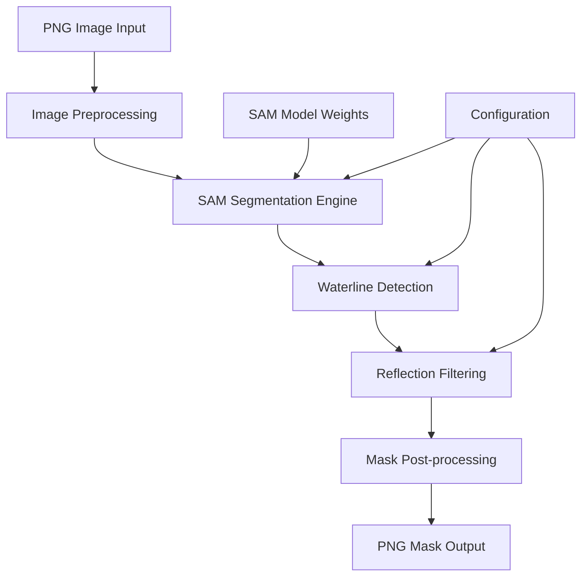

# Design Document: Manatee Segmentation System

## Overview

This system implements automated manatee body segmentation from RGB images using Meta's Segment Anything Model (SAM). The architecture combines SAM's zero-shot segmentation capabilities with specialized waterline detection and reflection filtering to extract only the visible manatee body above water surface.

The system processes a single PNG image input and produces a binary mask where manatee pixels above the waterline are white (255) and all other pixels are black (0). The approach leverages SAM's foundation model capabilities while adding domain-specific post-processing for marine animal analysis.

## Architecture

The system follows a pipeline architecture with four main processing stages:



The pipeline ensures that each stage can operate independently while maintaining data flow integrity. Error handling occurs at each stage with appropriate fallback mechanisms.

## Components and Interfaces

### 1. Image Loader
**Purpose**: Handles input validation and image preprocessing
**Interface**:
```python
class ImageLoader:
    def load_image(self, image_path: str) -> np.ndarray
    def validate_format(self, image_path: str) -> bool
    def get_image_info(self, image: np.ndarray) -> ImageInfo
```

### 2. SAM Segmentation Engine
**Purpose**: Core segmentation using Meta's SAM model
**Interface**:
```python
class SAMSegmentationEngine:
    def __init__(self, model_type: str = "vit_h", checkpoint_path: str = None)
    def generate_masks(self, image: np.ndarray) -> List[SegmentationMask]
    def filter_by_size(self, masks: List[SegmentationMask]) -> List[SegmentationMask]
    def select_primary_subject(self, masks: List[SegmentationMask]) -> SegmentationMask
```

**Implementation Details**:
- Uses the `segment-anything` Python library with ViT-H (Vision Transformer Huge) backbone
- Employs automatic mask generation mode for zero-shot detection
- Filters masks by area to focus on large objects (manatees)
- Selects the largest coherent mask as the primary manatee candidate

### 3. Waterline Detector
**Purpose**: Identifies water surface boundary using color and texture analysis
**Interface**:
```python
class WaterlineDetector:
    def detect_waterline(self, image: np.ndarray) -> WaterlineBoundary
    def analyze_water_regions(self, image: np.ndarray) -> List[WaterRegion]
    def estimate_surface_normal(self, boundary: WaterlineBoundary) -> Vector3D
```

**Implementation Strategy**:
- Analyzes HSV color space for water detection (blue/green hues, high saturation)
- Uses edge detection (Canny) to identify horizontal boundaries
- Applies Hough line transform to detect dominant horizontal lines
- Validates waterline candidates using texture analysis (LBP features)

### 4. Reflection Filter
**Purpose**: Removes reflection artifacts from water areas
**Interface**:
```python
class ReflectionFilter:
    def detect_reflections(self, image: np.ndarray, waterline: WaterlineBoundary) -> List[ReflectionRegion]
    def filter_mask_reflections(self, mask: np.ndarray, reflections: List[ReflectionRegion]) -> np.ndarray
    def validate_symmetry(self, region: ReflectionRegion) -> float
```

**Implementation Strategy**:
- Identifies symmetric patterns below waterline using template matching
- Analyzes brightness and color similarity between above/below waterline regions
- Uses morphological operations to clean up reflection boundaries
- Applies confidence scoring based on symmetry and color consistency

### 5. Mask Generator
**Purpose**: Creates final binary masks and handles output formatting
**Interface**:
```python
class MaskGenerator:
    def create_binary_mask(self, segmentation: SegmentationMask, image_shape: Tuple[int, int]) -> np.ndarray
    def apply_waterline_filter(self, mask: np.ndarray, waterline: WaterlineBoundary) -> np.ndarray
    def save_mask(self, mask: np.ndarray, output_path: str) -> bool
```

## Data Models

### Core Data Structures

```python
@dataclass
class ImageInfo:
    width: int
    height: int
    channels: int
    dtype: str
    file_size: int

@dataclass
class SegmentationMask:
    mask: np.ndarray  # Binary mask array
    bbox: Tuple[int, int, int, int]  # (x, y, width, height)
    area: int
    confidence: float
    stability_score: float

@dataclass
class WaterlineBoundary:
    points: List[Tuple[int, int]]  # Boundary points
    equation: Tuple[float, float, float]  # Line equation ax + by + c = 0
    confidence: float
    water_region_below: bool

@dataclass
class ReflectionRegion:
    mask: np.ndarray
    symmetry_score: float
    color_similarity: float
    bbox: Tuple[int, int, int, int]

@dataclass
class ProcessingResult:
    success: bool
    mask: Optional[np.ndarray]
    confidence: float
    processing_time: float
    error_message: Optional[str]
```

## Correctness Properties

*A property is a characteristic or behavior that should hold true across all valid executions of a system-essentially, a formal statement about what the system should do. Properties serve as the bridge between human-readable specifications and machine-verifiable correctness guarantees.*

Now I need to analyze the acceptance criteria to determine which ones can be converted to testable properties:
